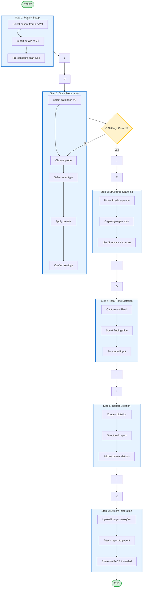

# Ultrasound Workflow - 6 Core Steps

---

**View online:** https://raw.githubusercontent.com/brendan134/mission-control/master/ultrasound-workflow-simple.html

(Open in browser - renders as interactive diagram)