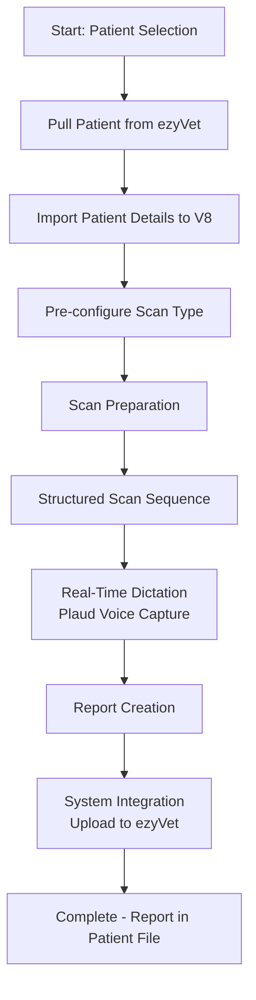
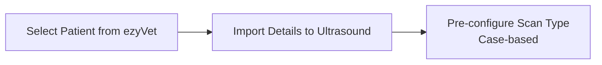
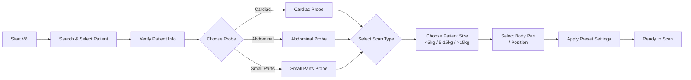
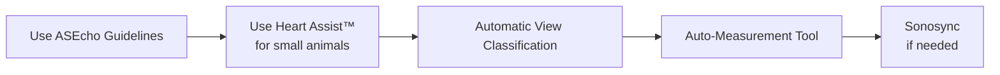
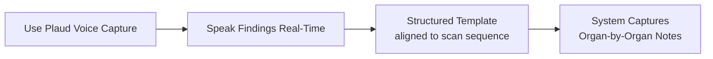
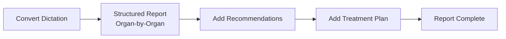
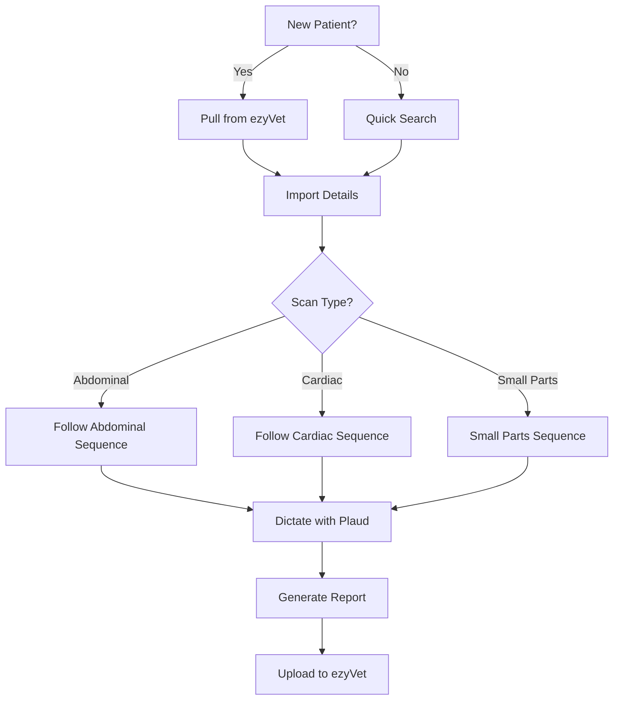
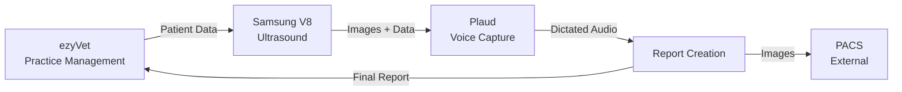

# Ultrasound Workflow - Visual Process Map

## High-Level Flow



---

## Step 1: Patient Setup



---

## Step 2: Scan Preparation



---

## Step 3: Structured Scanning Sequence

### Abdominal Scan Order

```mermaid
flowchart TD
    A[Start: Urinary Bladder] --> B[Prostate\n(if male)]
    B --> C[Left Kidney]
    C --> D[Left Adrenal Gland]
    D --> E[Spleen\nTail → Body → Head]
    E --> F[Liver]
    F --> G[Gall Bladder]
    G --> H[Stomach]
    H --> I[Duodenum]
    I --> J[Pancreas]
    J --> K[Right Adrenal Gland]
    K --> L[Right Kidney]
    L --> M[Intestines\nGeneral]
```

### Cardiac Scan



---

## Step 4: Real-Time Dictation



---

## Step 5: Report Creation



---

## Step 6: System Integration

```mermaid
flowchart LR
    A[Upload Images to ezyVet] --> B[Attach Report to Patient Record]
    B --> C[Send to PACS\n(if needed)]
    C --> D[Complete]
```

---

## Key Decision Points



---

## Integration Overview



---

## Key Principles

1. **Workflow First** → Define outcome, then align training/system
2. **Sequential > Flexible** → Fixed scan order reduces errors
3. **Reduce Decision Points** → Minimise thinking during scan
4. **Integration Non-Negotiable** → Must connect: V8 → Plaud → Reporting → ezyVet

---

_Generated from: Ultrasound Workflow design for vets..docx_
_Created: 2026-04-26_